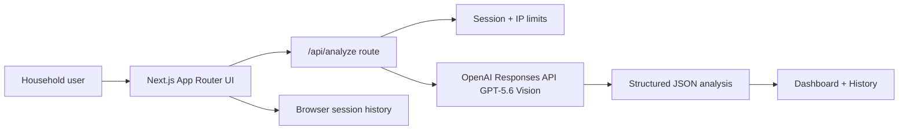
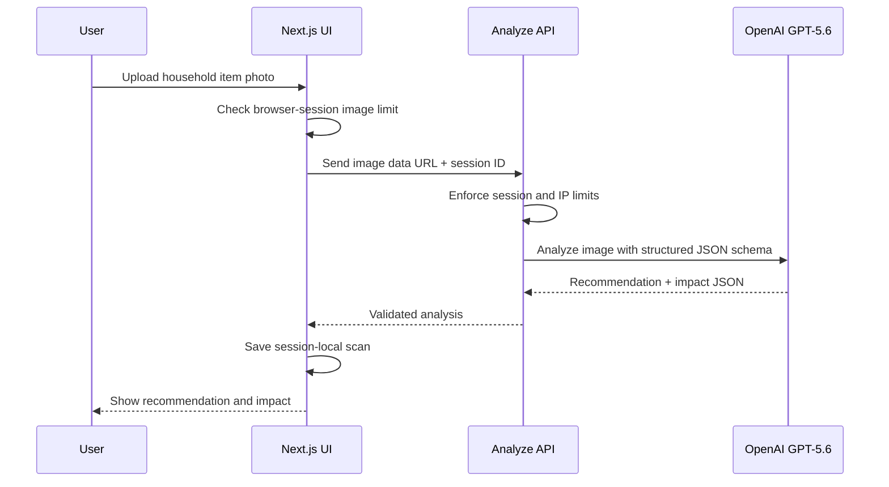

# HomeCycle AI

HomeCycle AI is an AI-powered home sustainability assistant for OpenAI Build Week. It helps households identify unused items from a photo and recommends the best next action: reuse, donate, sell, repair, upcycle, or recycle.

The goal is simple: make circular-economy decisions feel as easy as taking a picture.

## Devpost Summary

**Category:** Apps for Your Life

**What it does:** Users sign in, upload a household item photo, and receive a structured GPT-5.6 Vision analysis with material, condition, resale potential, repair viability, donation fit, recycling guidance, safety notes, and estimated environmental impact. Saved scans become a personal circular inventory dashboard.

**Why it matters:** Many useful items are thrown away because the next best step is ambiguous. HomeCycle AI turns that moment of uncertainty into a practical recommendation and impact record.

**How Codex was used:** Codex acted as senior full-stack engineer, product designer, AI architect, reviewer, and deployment partner. It scaffolded the Next.js/Supabase app, reviewed security and UX risks, hardened the OpenAI route, improved prompt reliability, generated docs, and verified production builds.

**How GPT-5.6 was used:** GPT-5.6 Vision powers the item analysis workflow. The app sends a short-lived Supabase signed image URL to OpenAI and requests strict structured JSON for reliable downstream UI and database storage.

## Core Features

- Mobile-first landing page, auth, dashboard, upload, and history
- No-login demo flow for frictionless judging
- Drag-and-drop, camera, and gallery image analysis
- Browser-session scan history and dashboard
- Client and server image-analysis limits to reduce bot/brute-force abuse
- GPT-5.6 Vision analysis with strict JSON schema output
- Zod runtime validation and normalization before saving results
- Dashboard stats for carbon saved, landfill avoided, resale value, and action mix
- Empty states, skeleton loaders, animated recommendation reveal, and polished glass UI
- Vercel deployment guardrails and environment verification

## Architecture





## Tech Stack

- **Frontend:** Next.js 15, React 19, TypeScript, TailwindCSS, shadcn-style primitives, Framer Motion, React Hook Form
- **Backend:** Next.js API routes
- **Demo persistence:** Browser session storage
- **Optional production backend:** Supabase Auth, Postgres, Storage schema included
- **AI:** OpenAI Responses API with GPT-5.6 Vision and structured JSON outputs
- **Deployment:** Vercel

## Environment Variables

Create `.env.local`:

```bash
OPENAI_API_KEY=
OPENAI_MODEL=gpt-5.6
NEXT_PUBLIC_SITE_URL=http://localhost:3000
```

Run:

```bash
npm run verify:env
```

## Demo Mode

The default app is intentionally no-login for demos. A browser session can analyze up to 6 images, enforced in the client and again in the API route. Session history clears when the browser session ends.

## Curated Demo Items

| Item | AI Recommendation | Key Reasoning |
| --- | --- | --- |
| Old wooden chair | Repair / Upcycle | Structurally sound despite scratches and worn finish. Repairing or creatively repurposing extends its life and avoids unnecessary waste. |
| Used books | Donate / Reuse | Books are in good condition and can benefit schools, libraries, charities, or other readers before considering recycling. |
| Broken plastic laundry basket | Recycle / Upcycle | Cracked body and broken handle reduce normal laundry use. Recycle through an appropriate plastic recycling facility if accepted locally, or reuse only for light-duty storage. |
| Used smartphone | Sell / Trade-in / E-waste recycle | Functional phones retain resale value. If non-functional, use an authorized e-waste recycler to recover valuable materials safely. |
| Glass jam jar | Reuse / Upcycle | Clean and undamaged glass jars are ideal for food storage, pantry organization, DIY crafts, or home decor before recycling. |
| Faded cotton T-shirt | Donate / Upcycle / Textile recycle | Wearable clothing can be donated. If too worn, repurpose into cleaning cloths or craft projects, with textile recycling as the final option. |

## Sustainability Hierarchy

The demo showcases a circular-economy decision process:

- **Reuse:** glass jar
- **Repair:** wooden chair
- **Upcycle:** chair, T-shirt, jar
- **Donate:** books, T-shirt
- **Sell / Trade-in:** smartphone
- **Recycle:** plastic basket, e-waste for a non-working phone, glass or textiles when reuse is no longer practical

## Optional Supabase Setup

The repository still includes a Supabase schema for a post-demo production path.

1. Create a Supabase project.
2. Run `supabase/schema.sql` in the Supabase SQL editor.
3. Enable Google OAuth in Supabase Auth.
4. Add the Supabase callback URL to Google Cloud authorized redirect URIs:

```text
https://bkmezswnmflvyytqoahd.supabase.co/auth/v1/callback
```

5. Add app redirect URLs in Supabase:

```text
http://localhost:3000/auth/callback
https://your-vercel-domain.vercel.app/auth/callback
```

## Local Development

```bash
npm install
npm run dev
```

Open [http://localhost:3000](http://localhost:3000).

## Production Deployment

1. Create a Vercel project from this repository.
2. Add all environment variables in Vercel Project Settings.
3. Run the Supabase SQL schema.
4. Add the Vercel auth callback URL in Supabase.
5. Deploy. `vercel.json` runs `npm run verify:env && npm run build`.

## Screenshots

Screenshot placeholders and capture notes live in [`docs/screenshots/README.md`](docs/screenshots/README.md).

## Demo Script

The 3-minute Devpost demo script lives in [`docs/DEMO_SCRIPT.md`](docs/DEMO_SCRIPT.md).

## Deployment Checklist

See [`docs/DEPLOYMENT_CHECKLIST.md`](docs/DEPLOYMENT_CHECKLIST.md).

## Security Notes

- The OpenAI API key and Supabase service role key are server-only.
- Demo mode does not require sign-in.
- The analyze route enforces per-session and per-IP limits before doing AI work.
- The browser also blocks analysis after the session limit is reached.
- Uploaded image type and size are validated client-side before upload.
